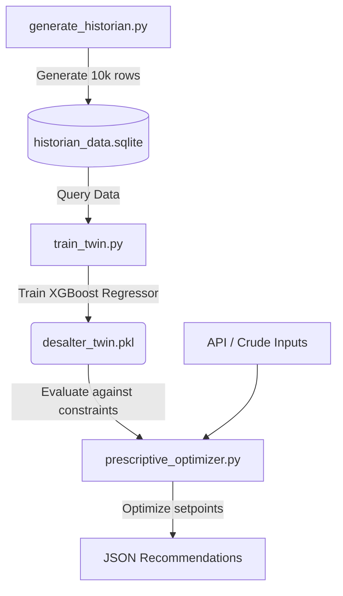

# 🔬 Desalter Setpoint Optimizer (Phase 2)

This directory contains the core implementation of the **Phase 2 Prescriptive Optimizer** for the IOCL Panipat Refinery Desalter Unit. The primary objective of this component is to minimize the desalter emulsion layer thickness, preventing downstream corrosion and instrument fouling by adjusting controllable operational setpoints under varying incoming crude conditions.

---

## 📂 Component Directory Structure

* **`generate_historian.py`**: Simulates process historian records based on desalter physics and saves it into an SQLite database.
* **`historian_data.sqlite`**: The simulated process database containing 10,000 historical crude processing entries.
* **`train_twin.py`**: Splits historical data, trains a gradient-boosted Digital Twin regressor, and serializes the model.
* **`desalter_twin.pkl`**: Serialized XGBoost digital twin model.
* **`prescriptive_optimizer.py`**: Executes a hybrid optimization (Global Grid Search + Local Powell Refinement) to recommend optimal setpoints.

---

## 🔄 Workflow & Architecture



### 1. Data Generation (`generate_historian.py`)
Generates 10,000 rows of process history simulating various crude batches. The data incorporates physical constraints:
* **Optimal Temperature**: Lighter crudes and high BSW require slightly lower temperatures to prevent foaming.
* **Optimal Wash Water**: Heavier crudes and high BSW require more wash water.
* **Emulsion Thickness**: Increases quadratically as the heater temperature and wash water flow rate deviate from their optimal targets.

### 2. Digital Twin Training (`train_twin.py`)
Trains an **XGBoost Regressor** to mimic the response of the desalter unit.
* **Inputs (Features)**:
  * `API_Gravity` (Crude weight index, 20.0 to 45.0)
  * `Inlet_BSW` (Basic Sediment & Water %, 0.1% to 2.5%)
  * `Inlet_Salt_PTB` (Salt load in Pounds per Thousand Barrels, 10.0 to 60.0)
  * `Temperature_C` (Controllable, 110.0°C to 150.0°C)
  * `Wash_Water_Percent` (Controllable, 2.0% to 8.0%)
* **Target Variable**: `Emulsion_Thickness_mm` (Minimize this)

### 3. Prescriptive Setpoint Optimization (`prescriptive_optimizer.py`)
When a new batch of crude arrives with specific properties (`API_Gravity`, `Inlet_BSW`, `Inlet_Salt_PTB`), the optimizer searches for the setpoints of **Temperature** and **Wash Water** that minimize the predicted emulsion thickness. It uses a hybrid optimization approach:
1. **Global Grid Search**: Evaluates a dense grid of 6,000 combinations (100 temperatures × 60 wash water levels) in a fast batch prediction on the XGBoost Digital Twin model to locate the global optimum and avoid local minima.
2. **Local Powell Refinement**: Initialized at the grid winner, a SciPy Powell gradient-free minimizer fine-tunes the setpoints within the strict operating bounds:
   * **Temperature**: `[110.0, 150.0]` °C
   * **Wash Water**: `[2.0, 8.0]` %

---

## 🛠️ Step-by-Step Execution & Real Output

Here are the commands to run the entire pipeline locally, along with their actual outputs.

### Step 1: Generate Historian Data
Creates or updates the SQLite database with simulated process values.
```bash
python desalter_optimization/phase2_optimizer/generate_historian.py
```
**Actual Output:**
```text
Generating updated synthetic historian dataset...

Dataset Shape: (10000, 6)

Summary Statistics:
        API_Gravity     Inlet_BSW  ...  Wash_Water_Percent  Emulsion_Thickness_mm
count  10000.000000  10000.000000  ...        10000.000000           10000.000000
mean      32.353989      1.310872  ...            4.981183              32.039450
std        7.190753      0.694307  ...            1.735705              11.507136
min       20.000291      0.100379  ...            2.000100               8.252217
25%       26.158222      0.709470  ...            3.465633              23.189122
50%       32.313215      1.314152  ...            4.962303              30.121248
75%       38.500159      1.915550  ...            6.502862              39.477057
max       44.992942      2.499820  ...            7.999833              78.410878

[8 rows x 6 columns]

Saving to database at: C:\Users\Lenovo\OneDrive\Desktop\Iocl\Desalter-model\desalter_optimization\phase2_optimizer\historian_data.sqlite
Database update complete!
```

### Step 2: Train the Digital Twin Model
Loads the SQL data, splits it 80/20, trains XGBoost, evaluates, and saves the `.pkl` file.
```bash
python desalter_optimization/phase2_optimizer/train_twin.py
```
**Actual Output:**
```text
Loading historian data from SQLite database...
Loaded 10000 rows.
Split sizes - Train: 8000, Test: 2000

Training XGBoost Regressor (Digital Twin)...
Model training complete.

Evaluating model performance on test set...
Test RMSE: 2.2675 mm
Test R^2: 0.9610

Saving model to: C:\Users\Lenovo\OneDrive\Desktop\Iocl\Desalter-model\desalter_optimization\phase2_optimizer\desalter_twin.pkl
Verifying saved model file...
Verification inference successful! Predicted: 22.8376 vs Actual: 22.8086
```

### Step 3: Run the Prescriptive Optimizer
Provide specific crude conditions to get the optimized setpoints.

#### Case A: Default Crude Parameters (API=25.0, BSW=1.8, Salt=30.0)
```bash
python desalter_optimization/phase2_optimizer/prescriptive_optimizer.py
```
**JSON Output:**
```json
{
  "status": "success",
  "crude_conditions": {
    "API_Gravity": 25.0,
    "Inlet_BSW": 1.8,
    "Inlet_Salt_PTB": 30.0
  },
  "optimal_setpoints": {
    "Temperature_C": 135.86,
    "Wash_Water_Percent": 6.37
  },
  "predicted_emulsion_thickness_mm": 26.5573,
  "optimization_metadata": {
    "method_used": "Grid Search Global Minimum",
    "grid_search_raw_min": 26.5573,
    "powell_success": true,
    "powell_iterations": 1
  }
}
```

#### Case B: Custom Light Crude (API=40.0, BSW=0.5, Salt=15.0)
```bash
python desalter_optimization/phase2_optimizer/prescriptive_optimizer.py --api 40.0 --bsw 0.5 --salt 15.0
```
**JSON Output:**
```json
{
  "status": "success",
  "crude_conditions": {
    "API_Gravity": 40.0,
    "Inlet_BSW": 0.5,
    "Inlet_Salt_PTB": 15.0
  },
  "optimal_setpoints": {
    "Temperature_C": 138.69,
    "Wash_Water_Percent": 5.05
  },
  "predicted_emulsion_thickness_mm": 12.6773,
  "optimization_metadata": {
    "method_used": "Grid Search Global Minimum",
    "grid_search_raw_min": 12.6773,
    "powell_success": true,
    "powell_iterations": 1
  }
}
```

---

## 🛡️ Variable Bounds and Safety Validation

The optimizer validates input variables to alert operators of abnormal conditions. The operational limits are:

| Variable | Lower Bound | Upper Bound | Unit | Type |
|---|---|---|---|---|
| **API Gravity** | 20.0 | 45.0 | °API | Input (Uncontrollable) |
| **Inlet BSW** | 0.1 | 2.5 | % | Input (Uncontrollable) |
| **Inlet Salt** | 10.0 | 60.0 | PTB | Input (Uncontrollable) |
| **Temperature** | 110.0 | 150.0 | °C | Setpoint (Controllable) |
| **Wash Water** | 2.0 | 8.0 | % | Setpoint (Controllable) |

> [!WARNING]
> If any input crude properties lie outside their standard historical bounds, the script prints warnings before computing setpoints to alert operators of potential anomalies.
